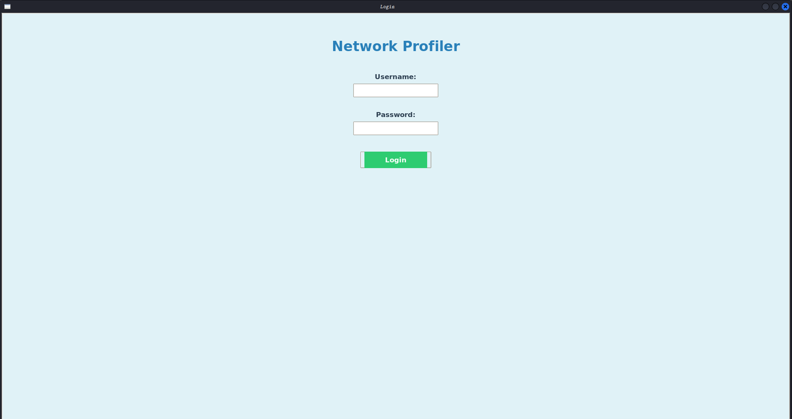
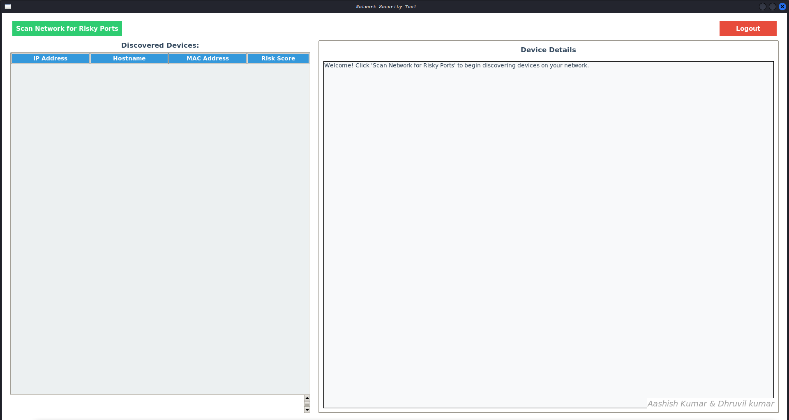
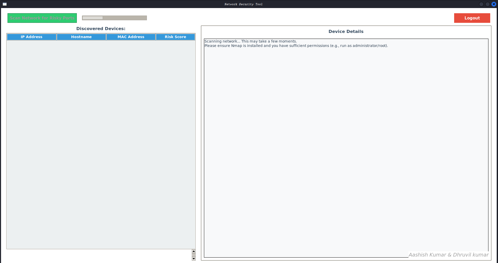
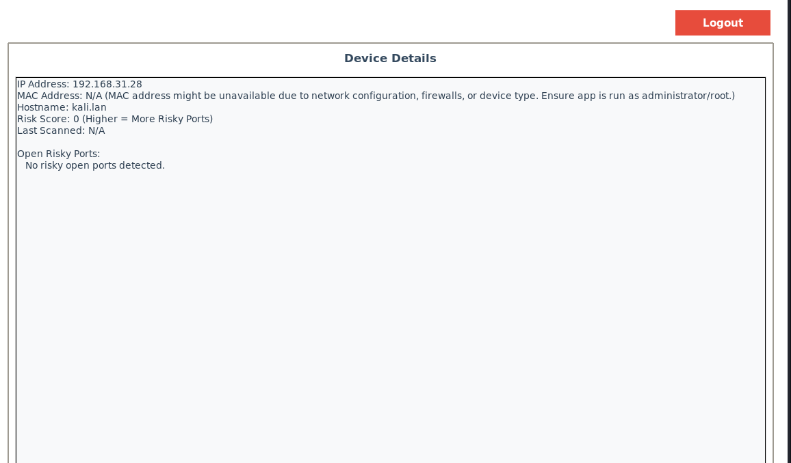
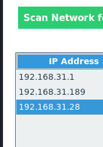

# 🔍 Network Scanner

A Python-based Network Scanner with GUI using Tkinter and Nmap.

---

## 🚀 Features
- Scan network for active devices
- Detect IP addresses
- Port scanning using Nmap
- Simple GUI interface
- User authentication system

---

## 🔐 Demo Credentials

| Username | Password |
|----------|---------|
| admin    | adminp  |

---

## 📸 Screenshots

### Login Screen


### Scan Input


### Scan Results


### Dashboard


### IP List


### Alert Popup


---

## ⚙️ Setup & Run

```bash
git clone https://github.com/Aashish-kumar77/Network-Scanner.git
cd Network-Scanner

python3 -m venv venv
source venv/bin/activate

pip install flask python-nmap
sudo apt install nmap python3-tk -y

python Network_Scanner.py

👨‍💻 Author

Aashish Kumar
